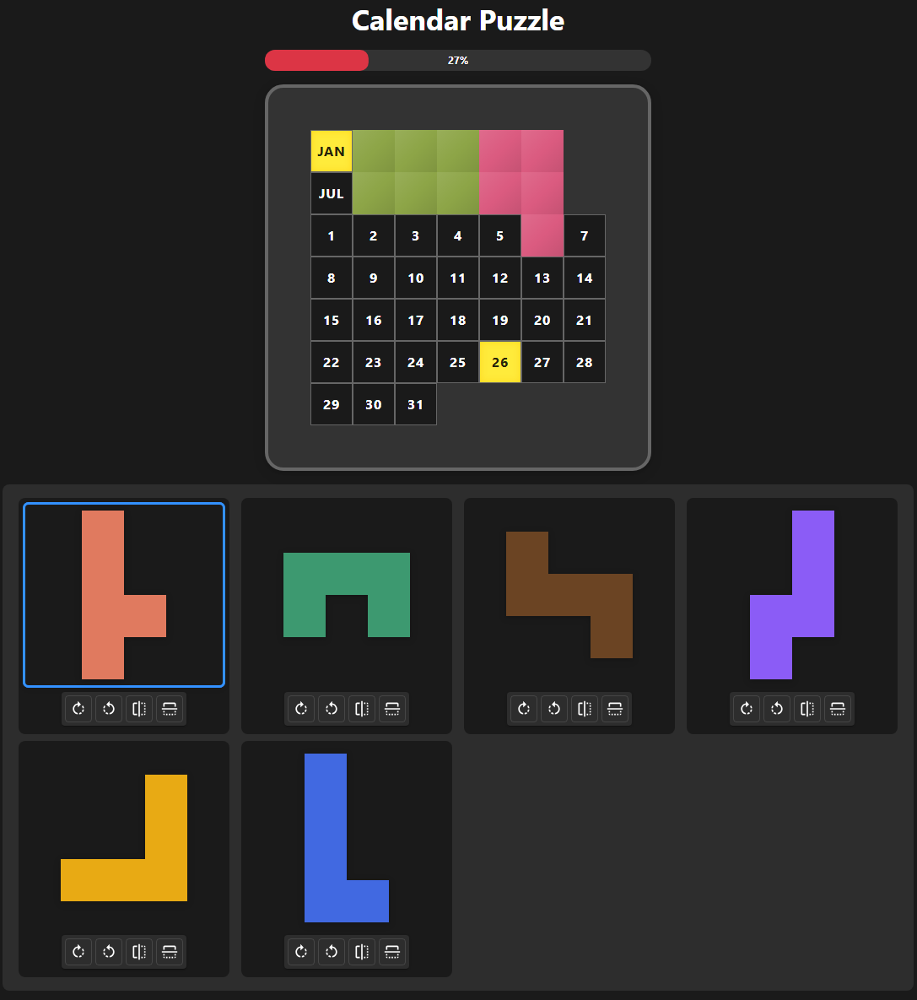

# Calendar Puzzle

A daily puzzle game where players arrange pieces on a calendar board to leave only the current date exposed. Built with React and Fastify.



## Game Overview

Each day presents a unique puzzle challenge:
- **Objective**: Place all 8 puzzle pieces on the board so that only the current month and day cells remain uncovered.
- **Daily Challenge**: The puzzle changes every day based on the date.
- **Controls**:
  - **Drag and Drop**: Move pieces onto the board.
  - **Rotate/Flip**: Use the controls on each piece to orient it correctly.
  - **Undo/Redo**: Use `Ctrl+Z` to undo and `Ctrl+Shift+Z` (or `Ctrl+Y`) to redo your moves.
  - **Reset**: Press `Escape` to clear the board.
- **Hint System**: Get help by requesting a hint that places one piece correctly.
- **Solution Reveal**: Stuck? Request the full solution (requires sign-in).
- **Statistics**: Track your progress, win percentage, and streaks.

## Tech Stack

- **Frontend**: React 19, TypeScript, Vite, Material UI (MUI), Emotion
- **Backend**: Fastify 5, Node.js, Passport.js (Google OAuth)
- **Database**: PostgreSQL with Drizzle ORM
- **Solver**: DLX (Dancing Links) algorithm for exact cover problems, running in a worker thread

## Project Structure

```
calendar-puzzle/
├─ src/
│  ├─ client/      # React frontend (UI layer)
│  │  ├─ components/   # Shared UI components (Board, Piece, Modals, etc.)
│  │  ├─ layouts/      # Three layouts: desktop/, mobile-portrait/, mobile-landscape/
│  │  │  └─ common/    # Shared hooks and components across layouts
│  │  ├─ context/      # React context (auth state)
│  │  ├─ hooks/        # Custom hooks (game history, session, layout detection)
│  │  ├─ pages/        # Page-level components (LandingPage)
│  │  ├─ service/      # REST API client
│  │  ├─ theme/        # MUI theme and color mode
│  │  └─ utils/        # UI utilities (drag helpers, encryption, colors)
│  ├─ server/      # Fastify backend
│  │  ├─ auth/         # Passport.js OAuth configuration and middleware
│  │  ├─ db/           # Drizzle schema, migrations, repositories
│  │  ├─ rest/         # Route handlers and JSON schemas
│  │  ├─ service/      # Business logic (solver, issue submitter)
│  │  ├─ utils/        # Server utilities (encryption, resource cache)
│  │  └─ workers/      # Worker threads (DLX puzzle solver)
│  └─ common/      # Pure game logic — no DOM, no React
│     ├─ gameLogic.ts      # Core rules, validation, transformations
│     ├─ puzzleSolver.ts   # DLX-based solver
│     ├─ boardOperations.ts # Pure board state mutations
│     ├─ streakUtils.ts    # Streak and history calculations
│     ├─ types.ts          # GameState, Piece, and other types
│     └─ restTypes.ts      # API request/response contracts
├─ test/           # Unit, integration, and E2E tests
├─ docs/           # Documentation
└─ public/         # Static assets
```

## Available Scripts

### Development

| Script | Description |
| :--- | :--- |
| `npm run dev` | Start Vite dev server (frontend only) |
| `npm run dev:all` | Start both frontend and backend in watch mode |

### Build

| Script | Description |
| :--- | :--- |
| `npm run build` | Build both client and server |
| `npm run build:client` | Build the React frontend |
| `npm run build:server` | Build the Fastify backend and worker scripts |
| `npm start` | Build everything, then start the production server |

### Testing

| Script | Description |
| :--- | :--- |
| `npm test` | Full test suite: type-check, eslint, jest, and Playwright E2E |
| `npm run jest` | Run unit tests with Jest |
| `npm run test:e2e` | Run Playwright E2E tests (headless) |
| `npm run test:e2e:headed` | Run E2E tests with browser visible |
| `npm run test:e2e:ui` | Run E2E tests with Playwright interactive UI |
| `npm run type-check` | TypeScript compile check (no emit) |
| `npm run eslint` | Lint `src/`, `test/`, and `scripts/` |
| `npm run eslint:fix` | Auto-fix lint issues |

### Database

| Script | Description |
| :--- | :--- |
| `npm run db:generate` | Generate Drizzle migrations from schema |
| `npm run db:migrate` | Apply pending migrations |
| `npm run db:studio` | Open Drizzle Studio to explore the database |
| `npm run db:docs` | Generate DB documentation |

### Deployment

| Script | Description |
| :--- | :--- |
| `npm run build:image` | Run full test suite, build, and create Docker image |
| `npm run deploy:dev` | Build image and start Docker Compose stack for dev |
| `npm run deploy:dev:quick` | Deploy to dev without running tests |
| `npm run deploy:production` | Build image and start Docker Compose stack for production |

### Admin

| Script | Description |
| :--- | :--- |
| `npm run admin:add` | Grant admin role to a user |
| `npm run admin:remove` | Revoke admin role from a user |

### Storybook

| Script | Description |
| :--- | :--- |
| `npm run storybook` | Start Storybook dev server (port 6006) |
| `npm run build-storybook` | Build static Storybook site |

## Getting Started

### Prerequisites

- Node.js 20+
- PostgreSQL (for backend features — hints, stats, OAuth)

### Development

1. **Install dependencies**:
   ```bash
   npm install
   ```

2. **Set up environment variables**:
   Copy `.env.example` to `.env` and fill in your database and OAuth credentials.

3. **Run the application**:
   ```bash
   # Run both frontend and backend
   npm run dev:all
   ```

### Production

```bash
# Build client + server, then start
npm start
```

### Docker

> **Local deployment only.** This is a personal project. Docker images are built and run on the same host machine and are never pushed to any registry. Both "Dev" and "Production" environments are local Docker Compose stacks.

```bash
# Build image and start production stack
npm run deploy:production

# Build image and start dev stack (different port)
npm run deploy:dev
```

## Documentation

| Document | Description |
| :--- | :--- |
| [ARCHITECTURE.md](docs/ARCHITECTURE.md) | System architecture, layer separation, directory structure, testing strategy |
| [AUTH.md](docs/AUTH.md) | Google OAuth implementation, session management, protected endpoints |
| [DB_SCHEMA.md](docs/DB_SCHEMA.md) | Database tables and relationships |
| [SESSION.md](docs/SESSION.md) | Local storage session persistence (board state across reloads) |
| [drag-drop-guidelines.md](docs/drag-drop-guidelines.md) | Drag-and-drop implementation: anchor cell, visual rect, empty-cell snap |
| [TODO.md](docs/TODO.md) | Open items and completed feature history |
| [DESIGN.md](docs/DESIGN.md) | Historical design elaborations for implemented features |

## License

ISC
