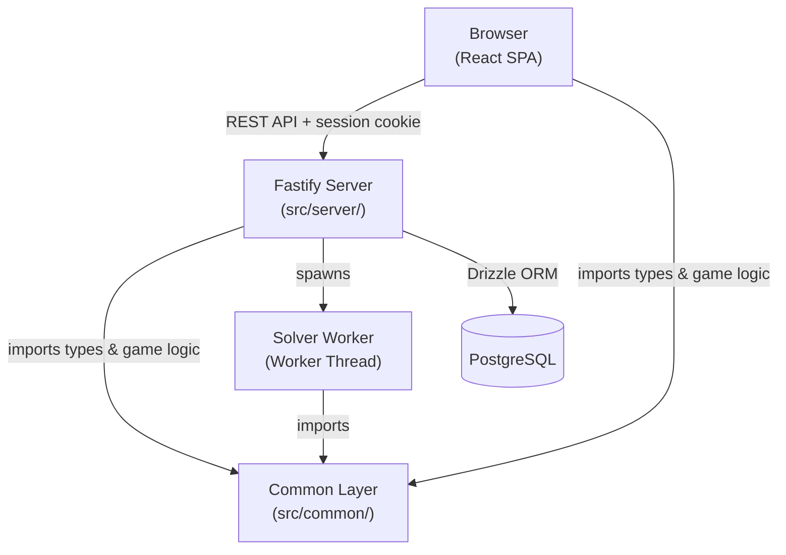
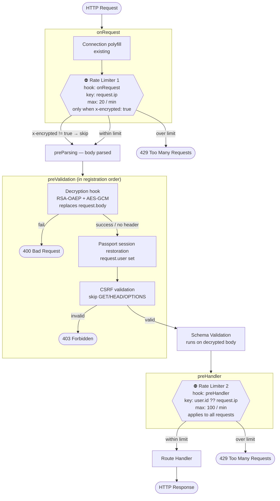

# Architecture Overview

This document describes the high-level architecture of the Calendar Puzzle application, with a focus on the separation between game logic and UI.

## Table of Contents

- [Architecture Principles](#architecture-principles)
- [Directory Structure](#directory-structure)
- [Common Layer (Pure Logic)](#common-layer-pure-logic)
- [Client Layer (UI)](#client-layer-ui)
- [Layout Architecture](#layout-architecture)
- [Drag and Drop System](#drag-and-drop-system)

---

## Architecture Principles

The codebase follows a clear separation of concerns:

1. **Pure Game Logic** (`src/common/`) - Framework-agnostic, testable, no DOM dependencies
2. **UI Layer** (`src/client/`) - React components, DOM interactions, presentation logic
3. **Backend** (`src/server/`) - Fastify server, database, authentication



### Why This Separation?

- **Testability**: Pure functions are easy to test in isolation
- **Reusability**: Game logic can be used in different contexts (e.g., solver worker, tests)
- **Maintainability**: Clear boundaries make the codebase easier to understand and modify
- **Performance**: Pure functions can be memoized and optimized

---

## Directory Structure

```
src/
├─ common/                      # Pure game logic (NO DOM, NO React)
│  ├─ boardOperations.ts       # Pure board state operations
│  ├─ consts.ts                # Game constants (board layout, months)
│  ├─ dlx.d.ts                 # Type declarations for the DLX solver library
│  ├─ gameLogic.ts             # Core game rules and validation
│  ├─ initialize.ts            # Board/piece/game initialisation
│  ├─ pieceData.ts             # Piece shape definitions
│  ├─ puzzleSolver.ts          # Puzzle solving algorithm
│  ├─ restPaths.ts             # API route path constants
│  ├─ restTypes.ts             # API request/response types
│  ├─ streakUtils.ts           # Streak and history calculation
│  ├─ types.ts                 # Type definitions
│  └─ utils/
│     └─ shapeHelpers.ts       # Pure shape analysis utilities
│
├─ client/                      # UI layer (React, DOM)
│  ├─ components/              # React components
│  │  ├─ Board.tsx             # Game board component
│  │  ├─ Piece.tsx             # Piece component
│  │  ├─ DraggablePiece.tsx    # dnd-kit draggable wrapper
│  │  ├─ PieceControls.tsx     # Rotate/flip controls
│  │  ├─ ProgressBar.tsx       # Board coverage progress bar
│  │  ├─ DatePicker.tsx        # Date navigation picker
│  │  ├─ StatsModal.tsx        # Statistics modal
│  │  ├─ HallOfFameModal.tsx   # Hall of fame modal
│  │  ├─ HelpModal.tsx         # Help/rules modal
│  │  ├─ IssueModal.tsx        # Bug report modal
│  │  ├─ LoginButton.tsx       # Google sign-in button
│  │  ├─ UserMenu.tsx          # User avatar + logout menu
│  │  ├─ HintButton.tsx        # Request hint (auth-gated)
│  │  ├─ SolutionButton.tsx    # Reveal solution (auth-gated)
│  │  └─ DebugPanel.tsx        # Debug overlay (?debug=1)
│  ├─ layouts/                 # Layout-specific code
│  │  ├─ LayoutRoot.tsx        # Selects layout based on device
│  │  ├─ LayoutContext.tsx     # Provides layout info to children
│  │  ├─ types.ts              # LayoutType and LayoutConfig types
│  │  ├─ desktop/
│  │  │  └─ DesktopLayout.tsx  # HTML5 DnD layout
│  │  ├─ mobile-portrait/
│  │  │  └─ PortraitLayout.tsx # Portrait layout
│  │  ├─ mobile-landscape/
│  │  │  └─ LandscapeLayout.tsx # Landscape layout
│  │  └─ common/
│  │     ├─ useGameController.ts      # Game state controller (all layouts)
│  │     ├─ DndProvider.tsx           # @dnd-kit provider (mobile)
│  │     ├─ useDndAdapters.ts         # dnd-kit event adapter hooks
│  │     ├─ PieceCarousel.tsx         # Embla-based piece carousel (mobile)
│  │     ├─ MobileToolbar.tsx         # Shared mobile toolbar
│  │     ├─ boardScale.ts             # Board scale calculation logic
│  │     ├─ useBoardScale.ts          # Board scale hook (resize-aware)
│  │     ├─ useGameModals.ts          # Modal open/close state
│  │     ├─ useServerSync.ts          # Server sync (stats, hints)
│  │     ├─ useSessionPersistence.ts  # Session save/restore
│  │     └─ useKeyboardShortcuts.ts   # Keyboard shortcut bindings
│  ├─ context/
│  │  └─ UserContext.tsx       # Auth state (useUser hook)
│  ├─ hooks/                   # React hooks
│  │  ├─ useGameHistory.ts     # Undo/redo functionality
│  │  ├─ useGameSession.ts     # Session persistence
│  │  ├─ useLayout.ts          # Responsive layout detection
│  │  └─ useQueryParam.ts      # URL query parameter management
│  ├─ pages/
│  │  └─ LandingPage.tsx       # Marketing/landing page
│  ├─ utils/                   # UI utilities
│  │  ├─ debugLogger.ts        # Circular-buffer debug logger
│  │  ├─ dragHelpers.ts        # DOM-aware drag utilities
│  │  ├─ encryption.ts         # Client-side payload encryption
│  │  ├─ measureUtils.ts       # DOM measurement helpers
│  │  └─ pieceColors.ts        # UI color definitions
│  └─ service/                 # API client
│     ├─ puzzleService.ts      # Game API calls
│     ├─ logService.ts         # Client-side log submission
│     └─ csrfService.ts        # CSRF token management
│
└─ server/                      # Backend (Fastify)
   ├─ app.ts                   # Server setup, plugins, middleware
   ├─ config.ts                # Startup config validation
   ├─ auth/                    # Passport OAuth + requireAuth middleware
   ├─ rest/                    # REST route handlers + JSON schemas
   ├─ service/                 # Business logic (solver, issue submitter)
   ├─ utils/                   # Server utilities (encryption, resource cache)
   ├─ workers/                 # Worker threads (DLX solver)
   └─ db/                      # Drizzle schema, migrations, repositories
```

---

## Common Layer (Pure Logic)

The common layer contains all game logic with **NO framework or DOM dependencies**.

### Key Modules

#### `boardOperations.ts`

Pure functions for manipulating board state:

```typescript
// Reconstruct board from saved pieces
rebuildGameState(pieces, date, isSolved): GameState

// Update board when moving a piece
updateBoardAndPieces(piece, newPosition, currentBoard, currentPieces): { board, pieces }
```

**Usage**: All layouts (`DesktopLayout.tsx`, `PortraitLayout.tsx`, `LandscapeLayout.tsx`) use these functions via `useGameController.ts`.

**Benefits**:
- Eliminates ~60 lines of duplicate code
- Pure functions are unit-testable
- Single source of truth for board operations

#### `gameLogic.ts`

Core game rules and validation:

```typescript
// Transform piece shape based on rotation/flips
getTransformedShape(piece): boolean[][]

// Validate piece placement
isValidPlacement(board, piece, position): boolean

// Check if puzzle is solved
puzzleSolvedForDate(pieces): PuzzleDate | null

// Calculate progress percentage
calculateProgress(pieces): { covered, total, percentage }
```

#### `utils/shapeHelpers.ts`

Pure shape analysis utilities:

```typescript
// Find top-left filled cell in a shape
findFirstFilledCell(shape): { x, y }

// Snap to nearest filled cell (for touch handling)
findNearestFilledCell(shape, fromX, fromY): { x, y } | null
```

**Why separate?** These functions replaced duplicated logic across 4 files:
- Reduced duplication (~40 lines)
- Makes them testable
- Centralizes shape analysis logic

#### `pieceData.ts`

Piece shape definitions (data only):

```typescript
export const PIECE_DATA: Record<PieceId, PieceData> = {
  1: { shape: [[true, false], [true, false], ...] },
  // ... 8 pieces total
}

export const getPieceShape = (id: number): boolean[][] => ...
```

**Note**: Colors were moved to `client/utils/pieceColors.ts` (presentation layer).

---

## Client Layer (UI)

The client layer contains all UI code, including React components and DOM interactions.

### Key Modules

#### `utils/dragHelpers.ts`

DOM-aware drag-and-drop utilities:

```typescript
// Find visual rect after CSS transforms
findVisualPieceRect(containerEl): { left, top, width, height } | null

// Convert pointer coordinates to cell position
calculateCellFromPointer(pointerX, pointerY, boardElement, scale, cellSize): Position | null
```

**Why in client?** These functions use `HTMLElement`, `getBoundingClientRect()`, and other DOM APIs.

#### `utils/pieceColors.ts`

UI color definitions:

```typescript
export const PIECE_COLORS: Record<PieceId, string> = {
  1: "#E07A5F", // Coral
  2: "#3D9970", // Teal
  // ... etc
}

export const getPieceColor = (id: number): string => ...
```

**Why separate from pieceData?** Colors are presentation logic, not game logic. This allows:
- Theme customization without touching game logic
- Different color schemes for different contexts
- Clear separation of data (shapes) from presentation (colors)

#### `hooks/useGameHistory.ts`

Undo/redo functionality using manual deep-cloning (spread operators):

```typescript
export function useGameHistory(initialState: GameState) {
  return {
    gameState,      // Current state
    pushState,      // Add new state to history
    updatePresent,  // Update current state
    undo,           // Go back
    redo,           // Go forward
    canUndo,        // Can we undo?
    canRedo,        // Can we redo?
    clearHistory    // Reset history
  }
}
```

---

## Backend (Server)

The server layer uses **Fastify 5** with plugins: helmet, CSRF, passport, rate-limit, session, and static file serving.

### Server Request Lifecycle

Each inbound HTTP request passes through Fastify hooks in a fixed order. The diagram below shows how the two rate limiters and the security middleware stack:



**Why two rate limiters?**

- **Rate Limiter 1** (`onRequest`, IP-keyed) guards the decryption path. Without it, an attacker can trigger unlimited RSA private-key operations by sending many requests with `x-encrypted: true` — the global decryption hook fires at `preValidation`, before the user-keyed limiter runs. Limiter 1 only activates when that header is present.
- **Rate Limiter 2** (`preHandler`, user/IP-keyed) applies to all requests. It runs at `preHandler` because `request.user` (populated by passport's session deserialization) is only guaranteed to be set by that point.

---

## Layout Architecture

The app supports three layouts with two drag-and-drop implementations. All layouts share `useGameController.ts` for game logic.

### Desktop Layout (`DesktopLayout.tsx`)

- Uses **HTML5 Drag and Drop API**
- Simpler implementation
- Proven, stable, no external dependencies

**Why keep it?** Desktop drag-and-drop works well with native HTML5 API. No need for heavy library.

### Mobile Layouts (`DndProvider.tsx`)

- Uses **@dnd-kit** library
- Supports touch events with proper delays
- Handles portrait (`PortraitLayout.tsx`) and landscape (`LandscapeLayout.tsx`) orientations
- More complex but handles mobile edge cases

**Why @dnd-kit?** Mobile drag-and-drop requires:
- Touch event handling with activation delays
- Proper visual feedback (drag overlay)
- Collision detection
- Smooth animations

### Shared Pure Functions

Both implementations use the same pure functions from `common/`:
- `rebuildGameState()` - Board reconstruction
- `updateBoardAndPieces()` - Board updates
- `getTransformedShape()` - Piece transformations
- `isValidPlacement()` - Placement validation

**Benefits**:
- Consistent game logic across all layouts
- Reduced duplication (~100 lines)
- Bug fixes apply to all layouts
- Easier to test

---

## Drag and Drop System

### Overview

The drag-and-drop system has three layers:

1. **Shape Analysis** (`common/utils/shapeHelpers.ts`) - Pure functions
2. **DOM Utilities** (`client/utils/dragHelpers.ts`) - DOM-aware functions
3. **UI Components** (`Board.tsx`, `DndProvider.tsx`) - React components

### Key Concepts

#### Anchor Cell

The **anchor cell** is the cell within a piece that the user grabbed when starting the drag.

**Example**: User grabs the middle cell of a 3-cell piece. When dropped, the piece position is calculated as:
```
piecePosition = dropCell - anchorOffset
```

**Why important?** Without tracking the anchor:
- Pieces would snap to their top-left corner
- User would lose visual feedback of where they grabbed
- Rotated pieces would behave unexpectedly

#### Visual Rect vs Layout Rect

CSS transforms (rotate, flip) are **purely visual** - they don't change the element's layout dimensions.

**Problem**: `element.getBoundingClientRect()` on the wrapper returns the pre-transform rect, which can be wrong for rotated pieces.

**Solution**: `findVisualPieceRect()` finds the inner CSS Grid element, which accounts for transforms.

**Example**:
```
Piece shape: [[T,F], [T,F], [T,T], [T,F]]  // 4 rows × 2 cols
After 90° rotation: [[T,T,T,T], [F,T,F,F]]  // 2 rows × 4 cols

Wrapper rect: 2×4 (outdated, pre-transform)
Visual rect:  4×2 (correct, post-transform)
```

#### Empty Cell Handling

Users can touch transparent gaps in the piece grid (empty cells).

**Problem**: If anchor lands on an empty cell, the drag might fail.

**Solution**: `findNearestFilledCell()` snaps the anchor to the nearest filled cell using Manhattan distance.

**See also**: `docs/drag-drop-guidelines.md` for full details.

---

## Testing Strategy

### Unit Tests — Common Layer

Pure functions tested in isolation (no DOM, no React):

| File | What it covers |
|---|---|
| `test/common/boardOperations.test.ts` | Board state mutations |
| `test/common/gameLogic.test.ts` | Core rules, validation, transformations |
| `test/common/puzzleSolver.test.ts` | DLX solver algorithm |
| `test/common/pieceData.test.ts` | Piece shape definitions |
| `test/common/shapeHelpers.test.ts` | `findFirstFilledCell`, `findNearestFilledCell` |
| `test/common/streakUtils.test.ts` | Streak and history calculations |
| `test/common/types.test.ts` | Type guard utilities |

### Unit Tests — Client Layer

React hooks and components tested with Jest + Testing Library:

| File | What it covers |
|---|---|
| `test/client/dragDrop.test.ts` | Drag-and-drop logic |
| `test/client/initialize.test.ts` | Game initialization |
| `test/client/useGameHistory.test.ts` | Undo/redo hook |
| `test/client/useGameSession.test.ts` | Session persistence hook |

### Unit Tests — Server Layer

Server routes and services tested with Fastify's inject API:

| File | What it covers |
|---|---|
| `test/server/rest/authRest.test.ts` | Auth endpoints |
| `test/server/rest/hintRest.test.ts` | Hint endpoint |
| `test/server/rest/statsRest.test.ts` | Stats endpoints |
| `test/server/auth/requireAuth.test.ts` | Auth middleware |
| `test/server/dateUtils.test.ts` | Date parsing utilities |
| `test/server/service/issueSubmitter.test.ts` | Issue submission service |

### E2E Tests

Playwright tests covering all three layouts:

| File | What it covers |
|---|---|
| `test/e2e/drag-drop.spec.ts` | Happy path and failing path drag-and-drop |
| `test/e2e/drag-stale-rect.spec.ts` | Rotated piece and empty-cell snap regressions |
| `test/e2e/solve.spec.ts` | Full puzzle solve flow |

Tests run across three Playwright projects: `desktop`, `mobile-portrait`, `mobile-landscape`.

See [`docs/e2e-drag-drop-tests.md`](./e2e-drag-drop-tests.md) for detailed E2E test documentation.

---

## Future Improvements

### Potential Refactorings (Optional)

1. **Unify Desktop and Mobile DnD**
   - Explore using @dnd-kit for desktop too
   - Risk: desktop works perfectly now, why fix it?

### Benefits of Current Architecture

- ✅ Clear separation of concerns
- ✅ Minimal duplication
- ✅ 100% test coverage on core logic
- ✅ Both layouts work reliably
- ✅ Easy to understand and maintain

**Recommendation**: Current architecture is solid. Future refactorings should be motivated by specific pain points, not just "cleaner code."

---

## References

- [CLAUDE.md](../CLAUDE.md) - Development workflow and commands
- [drag-drop-guidelines.md](./drag-drop-guidelines.md) - Drag-and-drop implementation details
- [DESIGN.md](./DESIGN.md) - Database schema and API design
