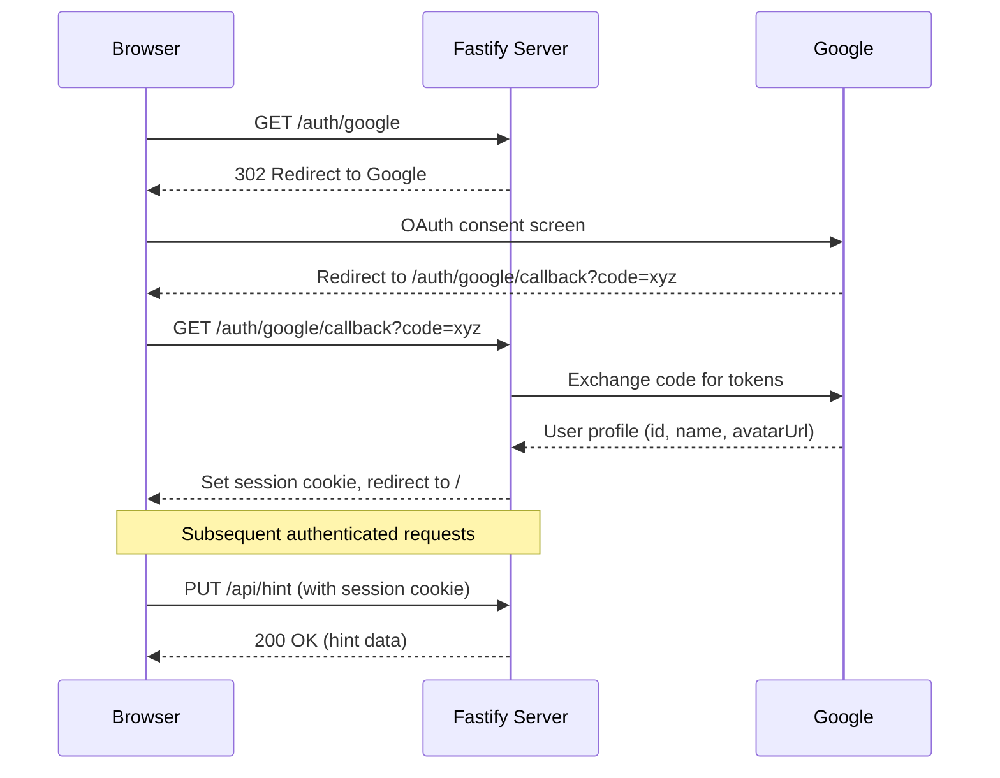
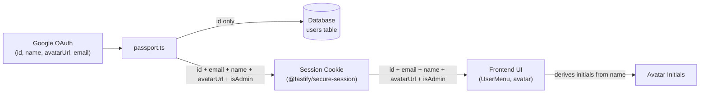

# Google OAuth Authentication

This document describes the Google OAuth implementation for the Calendar Puzzle application.

## Overview

Authentication is used to gate access to hint and solution features. Authenticated users can see and use the Hint and Solution buttons; anonymous users cannot.

**Current scope:**
- [x] Google OAuth sign-in
- [x] Session-based authentication (secure cookies)
- [x] Protected hint/solution API endpoints
- [x] Database persistence (users + puzzle stats in PostgreSQL)
- [ ] Game state sync across devices (future)

---

## Setup

### 1. Google Cloud Console

1. Go to [Google Cloud Console](https://console.cloud.google.com/)
2. Create a new project or select an existing one
3. Go to **APIs & Services** → **Credentials**
4. Click **Create Credentials** → **OAuth 2.0 Client ID**
5. Application type: **Web application**
6. Add all **Authorized redirect URIs** for your environments:
   - `http://localhost:3001/auth/google/callback`
   - `https://dev.yourdomain.com/auth/google/callback`
   - `https://yourdomain.com/auth/google/callback`
7. Save the **Client ID** and **Client Secret**

### 2. Environment Variables

Create a `.env` file with:

```env
GOOGLE_CLIENT_ID=your_client_id_here
GOOGLE_CLIENT_SECRET=your_client_secret_here
```

**Note:** `GOOGLE_CALLBACK_URL` is not needed - the callback URL is derived automatically from the request host using a relative path (`/auth/google/callback`).

### 3. Generate Session Secret Key

The `@fastify/secure-session` plugin requires a 32-byte cryptographic key file:

```bash
# Linux/macOS
npx @fastify/secure-session > secret-key

# Windows (PowerShell) - use Node.js to avoid encoding issues
node -e "require('fs').writeFileSync('secret-key', require('crypto').randomBytes(32))"
```

This file is in `.gitignore`. Each environment needs its own `secret-key` file.

### 4. Generate Hall of Fame Pepper

`GET /api/hall-of-fame` returns a pseudonymous `userKey` per user instead of the raw
Google ID, computed as `HMAC-SHA256(googleId, HALL_OF_FAME_PEPPER)`. This is an HMAC
rather than a bare hash so the mapping can't be recomputed by anyone outside the
server — the hashing algorithm is public (it's in this open-source repo), but the
pepper is not.

Generate a random value and add it to `.env`:

```bash
node -e "console.log(require('crypto').randomBytes(32).toString('hex'))"
```

```env
HALL_OF_FAME_PEPPER=<paste generated value here>
```

**Each environment needs its own pepper**, generated independently — same principle
as `secret-key`. Generate it once and never regenerate it in place: changing the
pepper reshuffles every user's public `userKey` (and therefore their leaderboard
avatar) on the next deploy.

---

## Architecture



---

## Implementation

### Server Files

| File | Purpose |
|------|---------|
| `src/server/auth/passport.ts` | Google OAuth strategy configuration |
| `src/server/auth/requireAuth.ts` | Authentication middleware |
| `src/server/rest/authRest.ts` | OAuth routes (`/auth/*`) |
| `src/server/app.ts` | Registers session, passport, and routes |

### Client Files

| File | Purpose |
|------|---------|
| `src/client/context/UserContext.tsx` | Auth state management (`useUser` hook) |
| `src/client/components/LoginButton.tsx` | "Sign in with Google" button |
| `src/client/components/UserMenu.tsx` | User avatar with logout menu |
| `src/client/components/HintButton.tsx` | Shows only when authenticated |
| `src/client/components/SolutionButton.tsx` | Shows only when authenticated |

### API Endpoints

| Method | Path | Auth | Description |
|--------|------|------|-------------|
| GET | `/auth/google` | No | Initiates OAuth flow |
| GET | `/auth/google/callback` | No | Handles OAuth callback |
| POST | `/auth/logout` | No | Clears session |
| GET | `/api/auth/me` | No | Returns current user info and history if logged in; otherwise `{ user: null, completedDates: [], playedDates: [] }` |
| GET | `/api/auth/csrf-token` | No | Get CSRF token for mutation requests |
| GET | `/api/auth/public-key` | Yes | Get server RSA public key for payload encryption |
| PUT | `/api/hint` | Yes | Get a hint and record its usage |
| GET | `/api/hint/:date/state` | Yes | Check whether a hint was used for a given date |
| GET | `/api/admin/solution/:date` | Admin | Returns full solution |
| GET | `/api/hall-of-fame` | Yes | Returns user activity statistics |

---

## Configuration Details

### Trust Proxy

The server and OAuth strategy are configured to correctly handle reverse proxies (Cloudflare, nginx, etc.):

1. **Fastify**: `trustProxy: 1` - trusts exactly one proxy hop (Cloudflare Tunnel/Docker → Fastify) for `X-Forwarded-*` headers used in IP detection
2. **GoogleStrategy**: `proxy: true` - uses `X-Forwarded-Proto` header for protocol detection when building the callback URL

This ensures:

- Correct protocol detection (http vs https)
- Correct host detection for callback URL resolution
- Secure cookies work correctly behind proxies

### Session Cookies

```typescript
cookie: {
    path: '/',
    httpOnly: true,                                    // Prevents XSS attacks
    secure: config.server.nodeEnv === 'production',    // HTTPS only in prod
    sameSite: 'lax',                                   // CSRF mitigation
    maxAge: 7 * 24 * 60 * 60                           // 7 days (seconds)
}
```

---

## Docker Deployment

Credentials are passed via environment variables, and the session key is mounted as a file:

```yaml
environment:
  - GOOGLE_CLIENT_ID=${GOOGLE_CLIENT_ID}
  - GOOGLE_CLIENT_SECRET=${GOOGLE_CLIENT_SECRET}
volumes:
  - ./secret-key:/usr/app/secret-key:ro
```

**Setup steps:**

1. Generate the `secret-key` file in the project root:
   ```bash
   # Linux/macOS
   npx @fastify/secure-session > secret-key
   
   # Windows (PowerShell)
   node -e "require('fs').writeFileSync('secret-key', require('crypto').randomBytes(32))"
   ```

2. Create a `.env` file with your Google credentials:
   ```env
   GOOGLE_CLIENT_ID=your_client_id
   GOOGLE_CLIENT_SECRET=your_client_secret
   ```

3. Run docker-compose:
   ```bash
   docker-compose up -d
   ```

**Note:** Each environment (dev, production) should have its own `secret-key` file. Changing the key will invalidate all existing sessions (users will be logged out).

---

## Testing Checklist

- [ ] OAuth flow redirects to Google
- [ ] Callback sets session and redirects to `/`
- [ ] `GET /api/auth/me` returns user info when logged in
- [ ] `GET /api/auth/me` returns `{ user: null, completedDates: [], playedDates: [] }` when not logged in
- [ ] Hint/Solution buttons appear only when authenticated
- [ ] `PUT /api/hint` returns 401 for anonymous users
- [ ] `GET /api/admin/solution/:date` returns 401 for anonymous users
- [ ] Logout clears session and hides buttons
- [ ] Session persists across page refresh

---

## Privacy / PII Design

Google OAuth provides the user's name, avatar URL, and email. Only the stable **Google ID** (plus an `is_admin` flag) is persisted to the database — all PII stays in the session cookie.



**Rationale:** Storing only the Google ID means the database holds no personal data. If the database were compromised, no PII would be exposed. The session payload (which includes email, name, avatar URL) lives inside the encrypted `@fastify/secure-session` cookie carried by the browser — never written to a server-side disk store. The frontend derives the avatar initials from `name` client-side (`UserMenu.tsx`).

**Surfaces visible to other users or the public:**
- `GET /api/hall-of-fame` never returns the raw Google ID — it returns `userKey`, an `HMAC-SHA256(googleId, HALL_OF_FAME_PEPPER)` computed per request (see [Setup](#4-generate-hall-of-fame-pepper)). No column stores this; it's derived at query time.
- GitHub issues created via `/api/issue` or the automated invalid-solution reporter (`issueSubmitter.ts`) carry no reporter/user identifier of any kind — this repo's issue tracker is public once the repo is public, so nothing traceable to a Google account is included.

---

## Future Enhancements

### Database Integration

Database persistence is **implemented**: `users` and `userPuzzleStats` tables exist, migrations run via Drizzle ORM, and all stats routes read/write PostgreSQL. Cross-device real-time game-state sync remains a future item.

### Security Improvements

- [x] Rate limit `/auth/*` endpoints
- [x] CSRF protection (`/api/auth/csrf-token`)
- [x] IP-only rate limiter for encrypted requests (`onRequest`, before decryption) — see [ARCHITECTURE.md](./ARCHITECTURE.md#server-request-lifecycle)
- [x] Session expiration (7-day `maxAge` on session cookie)
- [ ] Session rotation
