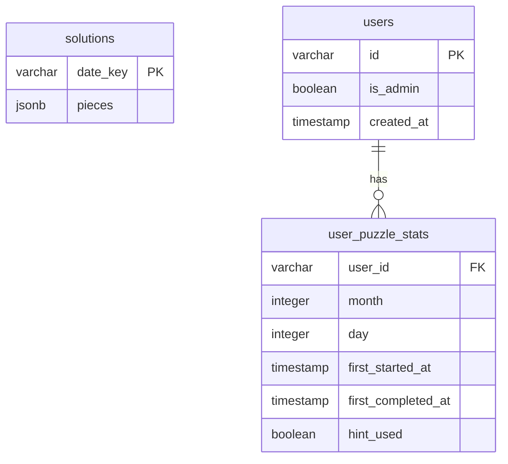

# Database Schema

This diagram shows the database tables and their relationships.

## Tables

### solutions
Stores pre-calculated solutions for each day of the year.
- `date_key`: Format 'MM-DD' (e.g., '01-01').
- `pieces`: JSON representation of the solution pieces and their positions.

### users
Stores user information from Google OAuth.
- `id`: Unique Google ID string.
- `is_admin`: Flag for administrative access.

### user_puzzle_stats
Tracks user progress and statistics for individual puzzles.
- `user_id`: Reference to the user.
- `month`: Part of the puzzle date (0-indexed: 0 = January).
- `day`: Part of the puzzle date (1–31).
- **Primary key**: Composite `(user_id, month, day)` — one row per user per date.

