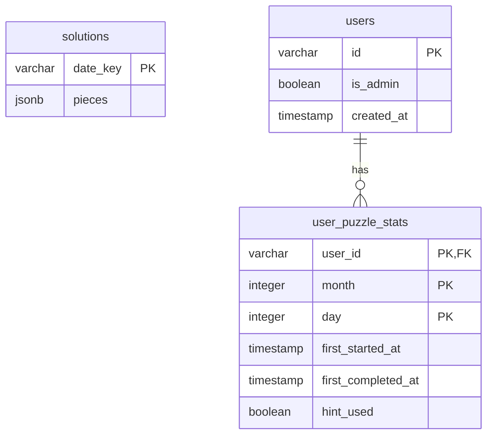

# Database Schema

This diagram shows the database tables and their relationships.

## Tables

### solutions
Stores pre-calculated solutions for each day of the year.
- `date_key`: Format 'MM-DD' (e.g., '01-01').
- `pieces`: JSON representation of the solution pieces and their positions.

### users
Stores user information from Google OAuth.
- `id`: Unique Google ID string.
- `avatarUrl`: Optional URL for the user's avatar (not stored in DB, only in session).
- `isAdmin`: Flag for administrative access.

### user_puzzle_stats
Tracks user progress and statistics for individual puzzles.
- `userId`: Reference to the user.
- `month` / `day`: The specific date of the puzzle.
- `firstStartedAt`: When the user first opened the puzzle.
- `firstCompletedAt`: When the user first solved the puzzle.
- `hintUsed`: Whether the user used a hint for this puzzle.
