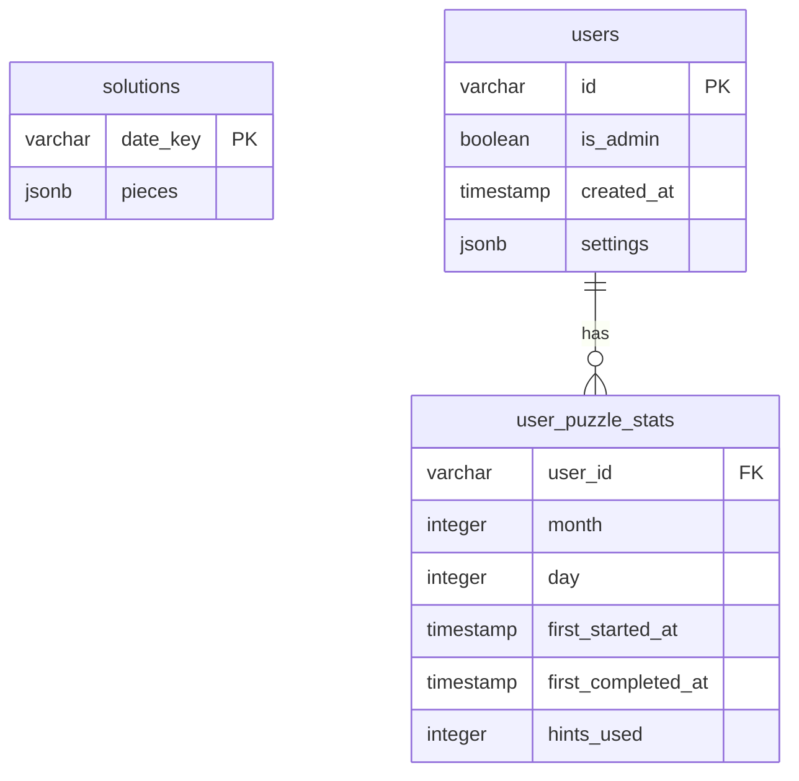

# Database Schema

This diagram shows the database tables and their relationships.

```mermaid
erDiagram
    solutions {
        varchar date_key PK
        jsonb pieces
    }

    users {
        varchar id PK
        boolean is_admin
        timestamp created_at
        jsonb settings
    }

    user_puzzle_stats {
        varchar user_id FK
        integer month
        integer day
        timestamp first_started_at
        timestamp first_completed_at
        integer hints_used
    }

    users ||--o{ user_puzzle_stats : "has"
```

## Tables

### solutions
Stores pre-calculated solutions for each day of the year.
- `date_key`: Format 'MM-DD' (e.g., '01-01').
- `pieces`: JSON representation of the solution pieces and their positions.

### users
Stores user information from Google OAuth.
- `id`: Unique Google ID string.
- `is_admin`: Flag for administrative access.
- `settings`: Per-user UI settings (`UserSettings` in `src/common/restTypes.ts`), e.g. `tokenIntroSeen`, `skipTokenConfirm`. Defaults to `{}`.

### user_puzzle_stats
Tracks user progress and statistics for individual puzzles.
- `user_id`: Reference to the user.
- `month`: Part of the puzzle date (0-indexed: 0 = January).
- `day`: Part of the puzzle date (1–31).
- `first_completed_at`: Set once, on the first valid solve. Each non-null value earns one hint token.
- `hints_used`: Hints used for the date (0–7, `CHECK hints_used_range`). Every hint after the first costs one token.
- The token balance is not stored: it is the count of solved dates minus the sum of `max(hints_used - 1, 0)`.
- **Primary key**: Composite `(user_id, month, day)` — one row per user per date.

