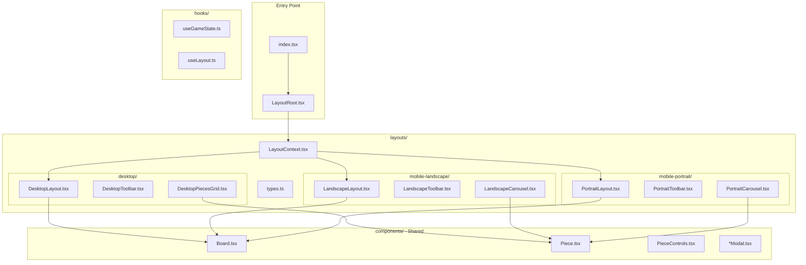

# Multi-Layout Architecture Refactor

## Overview

Refactor the calendar puzzle game to support 3 distinct layouts (Desktop, Mobile Landscape, Mobile Portrait) through a modular layout system with shared core logic and layout-specific presentation components.

## Current State Analysis

The game currently has a single responsive layout in `Game.tsx` (1154 lines) that uses viewport-based scaling (`ScaleContainer`) to fit different screen sizes. The pieces are displayed in a 4x2 grid (`PiecesContainer` with `gridTemplateColumns: repeat(4, 1fr)`).

### Key Components to Preserve (Common)

- Game logic and state management (`useGameHistory`, `useGameSession`)
- Cell size calculations (`measureUtils.ts`, theme tokens)
- Core components: `Board`, `Piece`, `PieceControls`
- All modals: `StatsModal`, `HelpModal`, `HallOfFameModal`, `IssueModal`
- Services and utilities
- Theme system

### Layout-Specific Concerns

- Scaling approach (viewport-based vs container-based)
- Pieces container presentation (grid vs carousel)
- Toolbar/controls arrangement
- Component positioning and spacing

---

## Proposed Architecture



---

## Directory Structure

```
src/client/
├── index.tsx                      # Entry point (unchanged)
├── components/
│   ├── Board.tsx                  # Shared (unchanged)
│   ├── Piece.tsx                  # Shared (unchanged)
│   ├── PieceControls.tsx          # Shared (unchanged)
│   ├── *Modal.tsx                 # Shared (unchanged)
│   └── ...                        # Other shared UI components
├── layouts/
│   ├── index.ts                   # Re-exports
│   ├── types.ts                   # Layout types and interfaces
│   ├── LayoutRoot.tsx             # Root component - chooses layout
│   ├── LayoutContext.tsx          # Provides layout info to children
│   ├── common/
│   │   ├── useGameController.ts   # Extracted game state/handlers
│   │   ├── GameToolbar.tsx        # Base toolbar (composable)
│   │   └── scaling.ts             # Cell size calculation utilities
│   ├── desktop/
│   │   ├── index.ts
│   │   ├── DesktopLayout.tsx      # Main desktop layout
│   │   ├── DesktopLayout.styled.ts
│   │   └── DesktopPiecesGrid.tsx  # 4x2 grid (current behavior)
│   ├── mobile-landscape/
│   │   ├── index.ts
│   │   ├── LandscapeLayout.tsx    # Board left, carousel right
│   │   ├── LandscapeLayout.styled.ts
│   │   └── LandscapeCarousel.tsx  # Horizontal piece carousel
│   └── mobile-portrait/
│       ├── index.ts
│       ├── PortraitLayout.tsx     # Board top, carousel bottom
│       ├── PortraitLayout.styled.ts
│       └── PortraitCarousel.tsx   # Horizontal piece carousel
├── hooks/
│   ├── useGameHistory.ts          # Existing (unchanged)
│   ├── useGameSession.ts          # Existing (unchanged)
│   └── useLayout.ts               # NEW: Detects/returns layout type
└── utils/
    └── measureUtils.ts            # Existing cell size utils (shared)
```

---

## High-Level Design

### 1. Layout Type System

Create `src/client/layouts/types.ts`:

```typescript
export type LayoutType = "desktop" | "mobile-landscape" | "mobile-portrait";

export interface LayoutConfig {
  type: LayoutType;
  cellSize: number;           // Computed cell size for this layout
  boardPadding: number;
  controlsSize: "small" | "medium" | "large";
}

export interface LayoutContextValue {
  layout: LayoutType;
  config: LayoutConfig;
}
```

### 2. Layout Root Component

Create `src/client/layouts/LayoutRoot.tsx`:

```typescript
// Single entry point that renders the appropriate layout
// Takes a layoutSelector prop (function) that determines which layout to use
// Actual selection logic is injected, not hardcoded here

interface LayoutRootProps {
  layoutSelector: () => LayoutType;
}

export const LayoutRoot: React.FC<LayoutRootProps> = ({ layoutSelector }) => {
  const layout = layoutSelector();
  
  return (
    <LayoutProvider layout={layout}>
      {layout === "desktop" && <DesktopLayout />}
      {layout === "mobile-landscape" && <LandscapeLayout />}
      {layout === "mobile-portrait" && <PortraitLayout />}
    </LayoutProvider>
  );
};
```

### 3. Game Controller Hook (Extract from Game.tsx)

Create `src/client/layouts/common/useGameController.ts`:

Extract all game state and handlers from `Game.tsx` into a reusable hook:

```typescript
export function useGameController() {
  // Move from Game.tsx:
  // - useGameHistory()
  // - All state: isLoading, draggedPieceId, invalidDropCells, modal states, etc.
  // - All handlers: handlePieceDrop, handleRotate, handleFlip*, handleReset, etc.
  // - useEffect hooks for session persistence, keyboard shortcuts
  
  return {
    // Game state
    gameState,
    isLoading,
    draggedPieceId,
    invalidDropCells,
    // ... all state
    
    // Handlers
    handlePieceSelect,
    handlePieceDrop,
    handleRotate,
    handleReset,
    // ... all handlers
    
    // Modal controls
    modals: {
      stats: { isOpen, open, close },
      help: { isOpen, open, close },
      // ...
    },
    
    // History
    canUndo, canRedo, undo, redo,
  };
}
```

### 4. Common Cell Size Calculation

Keep in `src/client/utils/measureUtils.ts` (existing):

The `getScaledCellSize()` function already handles cell size calculation for drag previews. Extend to support layout-specific base sizes:

```typescript
// Existing function stays unchanged
export function getScaledCellSize(themeCellSize: number, themeCellSizePx: string): number;

// NEW: Calculate optimal cell size for a given container
export function calculateCellSizeForContainer(
  containerWidth: number,
  containerHeight: number,
  boardColumns: number,  // 7 for this game
  boardRows: number,     // 7 for this game
  padding: number
): number;
```

---

## Low-Level Design

### Layout Component Pattern

Each layout follows the same pattern:

```typescript
// Example: DesktopLayout.tsx
export const DesktopLayout: React.FC = () => {
  const game = useGameController();  // All game logic
  const { config } = useLayoutContext();
  
  return (
    <DesktopContainer>
      <TopBar>
        {/* Toolbar components */}
      </TopBar>
      
      <GameArea>
        <Board 
          board={game.gameState.board}
          pieces={game.gameState.pieces}
          onPieceDrop={game.handlePieceDrop}
          // ... props from game controller
        />
        
        <DesktopPiecesGrid
          pieces={game.unplacedPieces}
          selectedPieceId={game.gameState.selectedPieceId}
          onPieceSelect={game.handlePieceSelect}
          // ... props
        />
      </GameArea>
      
      {/* Modals */}
      {game.modals.stats.isOpen && <StatsModal ... />}
      {game.modals.help.isOpen && <HelpModal ... />}
    </DesktopContainer>
  );
};
```

### Desktop Layout Specifics

- Preserves current behavior from `Game.tsx`
- Uses `ScaleContainer` with viewport-based scaling
- Pieces in 4x2 grid below the board
- Top toolbar with all controls

### Mobile Carousel Component

For mobile layouts, create a carousel that:

- Shows 1 full piece with controls at center
- Shows half of previous/next pieces on sides
- Supports touch swipe navigation
- Each piece is finger-friendly sized

```typescript
// Example: PortraitCarousel.tsx
export const PortraitCarousel: React.FC<CarouselProps> = ({
  pieces,
  selectedIndex,
  onSelect,
  onRotate,
  onFlip,
}) => {
  return (
    <CarouselContainer>
      <CarouselTrack translateX={calculateTranslateX(selectedIndex)}>
        {pieces.map((piece, index) => (
          <CarouselItem 
            key={piece.id}
            isCurrent={index === selectedIndex}
          >
            <Piece piece={piece} />
            {index === selectedIndex && (
              <PieceControls 
                piece={piece}
                onRotate={onRotate}
                // Mobile-sized controls
              />
            )}
          </CarouselItem>
        ))}
      </CarouselTrack>
    </CarouselContainer>
  );
};
```

### Mobile Landscape Layout

```
+------------------------------------------+
| [Controls Bar - Compact]                  |
+------------------+-----------------------+
|                  |  +-----------------+  |
|                  |  | [< ]  Piece  [>]|  |
|      Board       |  |   [Controls]    |  |
|                  |  +-----------------+  |
|                  |                       |
+------------------+-----------------------+
```

### Mobile Portrait Layout

```
+----------------------+
| [Controls - Stacked] |
+----------------------+
|                      |
|       Board          |
|                      |
+----------------------+
| [< ] Piece [>]       |
|    [Controls]        |
+----------------------+
```

---

## Migration Strategy

### Phase 1: Preparation (This Plan)

1. Create `layouts/` folder structure
2. Create `types.ts` with layout types
3. Create `LayoutContext.tsx` and `LayoutRoot.tsx` (with placeholder selector)
4. Extract `useGameController` hook from `Game.tsx`

### Phase 2: Desktop Layout

1. Create `DesktopLayout.tsx` using extracted hook
2. Move styled components to `DesktopLayout.styled.ts`
3. Update `index.tsx` to use `LayoutRoot`
4. Verify desktop still works identically

### Phase 3: Mobile Layouts (Future)

1. Implement `useLayout` hook with detection logic
2. Create carousel component
3. Build landscape and portrait layouts

---

## Files to Create

| File | Purpose |
|------|---------|
| `layouts/types.ts` | TypeScript types for layout system |
| `layouts/index.ts` | Re-exports |
| `layouts/LayoutRoot.tsx` | Root component that chooses layout |
| `layouts/LayoutContext.tsx` | Context provider for layout info |
| `layouts/common/useGameController.ts` | Extracted game state/logic |
| `layouts/common/scaling.ts` | Cell size utilities |
| `layouts/desktop/index.ts` | Desktop exports |
| `layouts/desktop/DesktopLayout.tsx` | Desktop layout component |
| `layouts/desktop/DesktopLayout.styled.ts` | Desktop styled components |
| `layouts/desktop/DesktopPiecesGrid.tsx` | 4x2 pieces grid |
| `hooks/useLayout.ts` | Layout detection hook |

## Files to Modify

| File | Changes |
|------|---------|
| `index.tsx` | Import and use `LayoutRoot` instead of `Game` |
| `Game.tsx` | Will be deprecated after extraction |
| `Game.styled.ts` | Move to desktop layout folder |

## Files Unchanged

- All components in `components/` (Board, Piece, Modals, etc.)
- `utils/measureUtils.ts` (extended, not modified)
- `hooks/useGameHistory.ts`, `useGameSession.ts`
- All services and theme files
