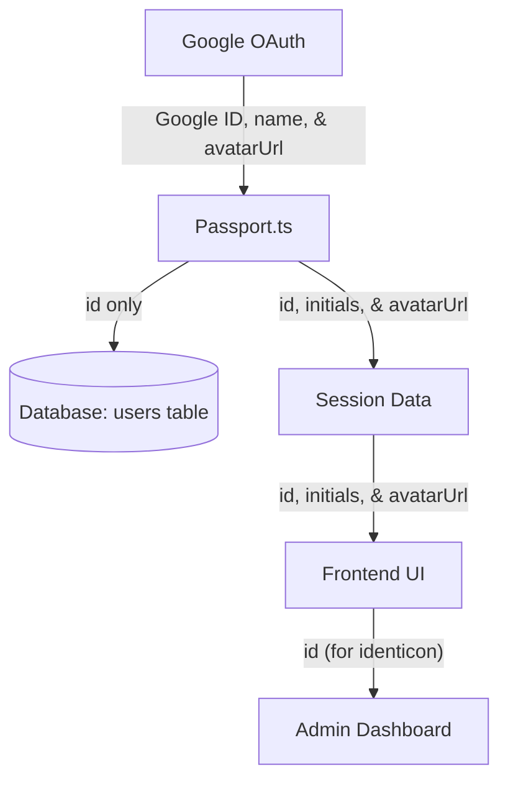

# Privacy and PII Removal Plan

This document outlines the strategy for removing Personally Identifiable Information (PII) from the database while maintaining user statistics and a personalized experience for authenticated users.

## Objectives
- Remove `email`, `name`, and `avatar_url` from the database.
- Use the stable Google ID as the primary identifier for statistics.
- Provide session-only PII (avatar, initials) to authenticated users for their own UI.
- Anonymize the Admin Dashboard using consistent identicons.

## Implementation Steps

### 1. Database Schema Changes
- Modify `src/server/db/schema.ts` to remove `email`, `name`, and `avatarUrl` from the `users` table.
- Generate and run a migration to drop these columns.

### 2. Authentication & Session Update
- Update `src/server/auth/passport.ts`:
    - Stop saving/updating `email`, `name`, and `avatarUrl` in the database.
    - Extract `avatarUrl` and `name` (to compute initials) from the Google profile.
    - Store these values in the session data so they are available to the client via `/api/auth/me`.

### 3. Frontend Anonymization
- **UserContext**: Update types to reflect that PII is optional and session-based.
- **UserMenu**: Continue displaying the user's avatar or initials from the session.
- **Admin Dashboard**: 
    - Replace names/emails with the Google ID.
    - Use a library (e.g., `minidenticons`) to generate consistent avatars from the ID.
- **Logging/Reporting**: Replace all instances of `user.name` or `user.email` with `user.id`.

### 4. Admin Tools
- Update `scripts/manage-admin.ts` to use user IDs instead of emails for administrative tasks.

## Data Flow

