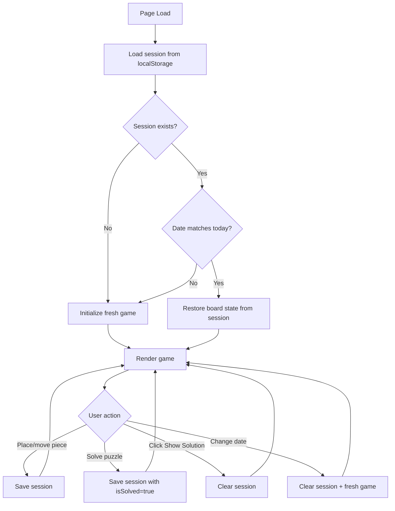

# Session (Local Storage)

Persist game state to localStorage so users can resume their progress after page reload. Only user progress is saved - if the user clicks "Show Solution", no session is saved.

## Session Data Model

```typescript
interface SessionData {
  date: PuzzleDate;      // { month, day }
  pieces: Piece[];       // Piece state (position, rotation, flips, isLocked)
  isSolved: boolean;     // Whether the user solved the puzzle
}
```

LocalStorage key: `calendar-puzzle-session`

## Session Flow



## Behavior Summary

| Action | Session Behavior |
|--------|------------------|
| Place/move piece | Save session |
| User solves puzzle | Save with `isSolved: true` |
| Click "Show Solution" | Clear session |
| Change date | Clear session |
| Page reload (date matches) | Restore session |
| Page reload (date differs) | Fresh game |

## Edge Cases

- **localStorage disabled**: All operations wrapped in try/catch, gracefully degrade to no persistence
- **Corrupted data**: `JSON.parse` in try/catch, return null on failure
- **Solution revealed**: Clear session, don't persist - user starts fresh on reload
- **Hint used**: Hint pieces have `isLocked: true`, this is preserved in session
